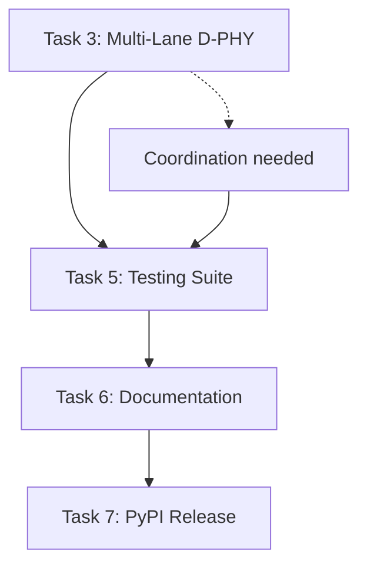

# Remaining Open Archon Task Backlog Implementation PRP

## Goal
Complete the remaining 5 open Archon tasks to deliver a production-ready cocotbext-mipi-csi2 framework with full D-PHY multi-lane support, non-continuous clock mode, comprehensive testing, documentation, and PyPI release.

## Why
- **Industry Readiness**: Multi-lane D-PHY (2, 4 lanes) is industry standard for high-bandwidth camera interfaces
- **Complete Non-Continuous Clock**: Receiver enhancement needed for full power-efficient CSI-2 operation
- **Production Quality**: Comprehensive testing, documentation, and release automation for enterprise adoption
- **Framework Completeness**: Fill remaining gaps to achieve feature parity with commercial CSI-2 VIP solutions

## What
Implement the remaining 5 Archon tasks in priority order to deliver a complete, production-ready MIPI CSI-2 simulation framework.

### Success Criteria
- [ ] **Multi-Lane D-PHY**: 2 and 4 lane configurations work with both continuous and non-continuous clock modes
- [ ] **Receiver Enhancement**: Non-continuous clock mode fully supported on receiver side
- [ ] **Comprehensive Testing**: >95% code coverage with multi-lane, multi-mode, and error injection tests
- [ ] **Complete Documentation**: Sphinx-based API docs, tutorials, hosted on Read the Docs
- [ ] **PyPI Release**: Version 0.3.0 published with automated release workflow
- [ ] **Performance**: <10% overhead for multi-lane configurations vs single-lane

## All Needed Context

### Documentation & References
```yaml
# MUST READ - Include these in your context window
- spec: MIPI CSI-2 v4.0.1 Specification Section 7.1
  why: D-PHY multi-lane requirements and timing coordination
  critical: Lane synchronization and skew tolerance requirements
  
- spec: MIPI D-PHY v2.5 Specification Section 10.2  
  why: Multi-lane data-clock timing specifications
  critical: Lane-to-lane skew requirements and clock recovery timing
  
- file: cocotbext/mipi_csi2/utils.py:114-156
  why: Existing bytes_to_lanes() and lanes_to_bytes() functions
  pattern: Lane distribution algorithm foundation already exists
  
- file: cocotbext/mipi_csi2/phy/dphy.py:725-850
  why: Current DPhyRxModel implementation and _monitor_clock_events()
  pattern: Receiver state machine and clock monitoring patterns
  
- file: tests/csi2_basic/test_csi2_basic.py:100-175
  why: Existing test patterns for packet transmission and validation
  pattern: TestFactory usage and cocotb test structure
  
- file: pyproject.toml:1-125
  why: Current build configuration and dependencies
  pattern: setuptools configuration and version management
```

### Current Codebase Tree (relevant files)
```bash
cocotbext/mipi_csi2/
├── about.py                   # Version: 0.2.0 -> needs bump to 0.3.0
├── phy/
│   └── dphy.py               # DPhyTxModel & DPhyRxModel - MAIN TARGETS
├── utils.py                  # bytes_to_lanes() & lanes_to_bytes() - ENHANCE
├── config.py                 # Csi2Config - lane_count parameter exists
tests/
├── csi2_basic/
│   └── test_csi2_basic.py    # Current test patterns - EXPAND
├── pending_csi2_multilane/   # Empty templates - IMPLEMENT
└── pending_csi2_dphy/        # Empty templates - IMPLEMENT
docs/                         # MISSING - CREATE
pyproject.toml                # Build config - ENHANCE
README.md                     # Basic only - EXPAND
```

### Implementation Priority Dependencies


### Known Gotchas & Library Quirks
```python
# CRITICAL: Multi-lane timing coordination challenges
# Lane skew tolerance per D-PHY spec: max 40% of UI (Unit Interval)
# UI = 1000.0 / bit_rate_mbps nanoseconds
# Must handle lane synchronization during non-continuous clock transitions

# CRITICAL: Existing lane distribution limitation
# Current bytes_to_lanes() in utils.py handles basic distribution
# But DPhyTxModel.send_packet_data() only uses single lane (line 618-620)
# Need to enhance multi-lane coordination in both TX and RX models

# CRITICAL: Receiver clock recovery with non-continuous mode
# Current _monitor_clock_events() samples on every clk_p edge (line 795)
# In non-continuous mode, clock lane goes LP-11 between packets
# Must detect LP-11 state and pause data sampling until clock returns

# CRITICAL: Test infrastructure requirements
# cocotb TestFactory for parameterized tests exists (line 430-432)
# Need to extend with multi-lane + clock mode combinations
# Current test structure supports 1-lane only effectively

# PATTERN: cocotb async/await timing
# All Timer() calls must be properly awaited for deterministic simulation
# Multi-lane coordination requires careful async task management

# GOTCHA: Lane signal access pattern
# Clock: self.bus.clk_p, self.bus.clk_n
# Data: self.bus.data{i}_p, self.bus.data{i}_n where i = 0,1,2,3
# Must validate all lane signals exist before accessing

# GOTCHA: Backward compatibility requirement
# All existing single-lane tests must continue to pass unchanged
# Multi-lane features are additive, not replacement
```

## Implementation Blueprint

### Task Priority & Implementation Order

#### **PHASE 1: Core Multi-Lane & Receiver Implementation**

##### Task 3: Complete D-PHY Multi-Lane Support (Priority: HIGH)
```python
# 1. Enhance DPhyTxModel for true multi-lane transmission
async def send_packet_data(self, data: bytes):
    """Enhanced to use all configured lanes"""
    # Current: only uses self.data_lanes[0] (line 618)
    # New: distribute data across all lanes using utils.bytes_to_lanes()
    
    if len(self.data_lanes) > 1 and self.config.lane_distribution_enabled:
        lane_data = bytes_to_lanes(data, len(self.data_lanes))
        # Send data on all lanes simultaneously with proper timing
        tasks = []
        for i, lane in enumerate(self.data_lanes):
            tasks.append(self._send_hs_data_on_lane(lane, lane_data[i]))
        await asyncio.gather(*tasks)
    else:
        # Single lane fallback (existing behavior)
        await self._send_hs_data_on_lane(self.data_lanes[0], data)

# 2. Enhance DPhyRxModel for multi-lane reception
async def _sample_data_lane(self, lane_idx: int):
    """Enhanced with lane synchronization"""
    # Current: basic per-lane sampling (line 799)
    # New: coordinate with other lanes for packet reconstruction
    
    # Handle non-continuous clock coordination
    if not self.config.continuous_clock:
        # Check if clock lane is in HS mode before sampling
        if not self._is_clock_lane_hs_active():
            return  # Skip sampling when clock is LP-11
    
    # Existing sampling logic enhanced with multi-lane coordination
```

##### Task 4: Receiver Clock Recovery Enhancement (Priority: HIGH)  
```python
# 1. Enhance _monitor_clock_events for non-continuous mode
async def _monitor_clock_events(self):
    """Enhanced clock monitoring for non-continuous mode"""
    while True:
        if self.config.continuous_clock:
            # Existing behavior: sample on every edge
            await Edge(self.bus.clk_p)
            for lane_idx in self.enabled_lanes:
                await self._sample_data_lane(lane_idx)
        else:
            # New: non-continuous mode handling
            await self._monitor_non_continuous_clock()

async def _monitor_non_continuous_clock(self):
    """Monitor clock lane state transitions in non-continuous mode"""
    # Detect LP-11 -> HS transition (start of packet)
    # Monitor HS toggles during packet transmission
    # Detect HS -> LP-11 transition (end of packet)
    # Coordinate with data lane sampling accordingly

# 2. Add clock state detection methods
def _is_clock_lane_hs_active(self) -> bool:
    """Detect if clock lane is in HS mode vs LP-11"""
    try:
        clk_p = int(self.bus.clk_p.value)
        clk_n = int(self.bus.clk_n.value)
        # HS mode: differential signaling (p != n)
        # LP-11 mode: both high (p=1, n=1)
        return clk_p != clk_n
    except (ValueError, TypeError):
        return False
```

#### **PHASE 2: Testing & Validation Implementation**

##### Task 5: Comprehensive Testing Suite Enhancement (Priority: MEDIUM)
```python
# 1. Multi-lane + clock mode test matrix
test_configurations = [
    # (lanes, clock_mode, bit_rate, data_type)
    (1, True, 500, "frame_start"),   # Baseline continuous
    (1, False, 500, "frame_start"),  # Non-continuous single
    (2, True, 1000, "frame_start"),  # Multi-lane continuous  
    (2, False, 1000, "frame_start"), # Multi-lane non-continuous
    (4, True, 1500, "frame_start"),  # High-speed multi-lane
    (4, False, 1500, "frame_start"), # High-speed non-continuous
]

# 2. Enhanced TestFactory usage
factory = TestFactory(run_comprehensive_csi2_test)
factory.add_option("lane_count", [1, 2, 4])
factory.add_option("continuous_clock", [True, False])  
factory.add_option("bit_rate_mbps", [500, 1000, 1500])
factory.add_option("packet_type", ["frame_start", "frame_end", "long_packet"])
factory.generate_tests()

# 3. Error injection testing framework
async def test_error_injection_scenarios(dut):
    """Test ECC errors, checksum errors, timing violations"""
    # Matrix of error types vs configurations
    # Validate error detection and recovery behavior
```

#### **PHASE 3: Documentation & Release Implementation**

##### Task 6: Comprehensive Documentation (Priority: LOW)
```bash
# 1. Sphinx documentation structure
docs/
├── source/
│   ├── conf.py              # Sphinx configuration
│   ├── index.rst            # Main documentation index  
│   ├── api/                 # API reference (auto-generated)
│   ├── tutorials/           # Getting started guides
│   └── examples/            # Code examples
├── Makefile                 # Build commands
└── requirements.txt         # Documentation dependencies

# 2. Read the Docs integration
.readthedocs.yaml           # RTD configuration file
```

##### Task 7: PyPI Release v0.3.0 (Priority: LOWEST)
```bash
# 1. Version bump and release automation
.github/workflows/
├── ci.yml                  # Existing CI/CD
├── release.yml             # New: automated releases
└── docs.yml               # New: documentation builds

# 2. Release checklist automation
# - Version bump in about.py: 0.2.0 -> 0.3.0
# - Generate release notes from Archon tasks
# - Build and test distribution packages  
# - Upload to PyPI with authentication
```

### Per Task Implementation Details

#### Task 3: Multi-Lane D-PHY Implementation Steps
1. **Enhance utils.py lane distribution** (if needed)
2. **Modify DPhyTxModel.send_packet_data()** for true multi-lane
3. **Enhance DPhyRxModel lane coordination** and packet reconstruction  
4. **Add multi-lane timing validation** and lane skew handling
5. **Coordinate with non-continuous clock** for all lane configurations

#### Task 4: Receiver Enhancement Implementation Steps  
1. **Enhance _monitor_clock_events()** for non-continuous detection
2. **Add clock state detection methods** (_is_clock_lane_hs_active)
3. **Implement _monitor_non_continuous_clock()** state machine
4. **Coordinate data sampling** with clock lane state
5. **Validate packet reconstruction** with intermittent clock

#### Task 5: Testing Suite Implementation Steps
1. **Create comprehensive test matrix** (lanes × clock_mode × bit_rates)
2. **Implement error injection framework** (ECC, checksum, timing)
3. **Add performance benchmarking** and power analysis tests  
4. **Create pattern generators** (ramp, checkerboard, solid)
5. **Validate >95% code coverage** across all configurations

#### Task 6: Documentation Implementation Steps
1. **Set up Sphinx structure** with API auto-generation
2. **Write getting started tutorials** with code examples
3. **Document timing parameters** and configuration guidance
4. **Create migration guides** and troubleshooting sections
5. **Set up Read the Docs hosting** with automated builds

#### Task 7: PyPI Release Implementation Steps
1. **Set up GitHub Actions** for automated releases
2. **Version management** and release notes generation
3. **Distribution building** and testing automation
4. **PyPI authentication** and upload automation  
5. **Release validation** and rollback procedures

## Validation Loop

### Level 1: Syntax & Style Validation
```bash
# Run these FIRST - fix any errors before proceeding
python3 -m py_compile cocotbext/mipi_csi2/phy/dphy.py
python3 -m py_compile cocotbext/mipi_csi2/utils.py

# Expected: No syntax errors in enhanced multi-lane implementations
```

### Level 2: Unit Tests - Multi-Lane Functionality
```bash
# Test multi-lane configurations
cd tests/csi2_basic
make MODULE=test_csi2_basic TESTCASE=test_multilane_continuous_clock
make MODULE=test_csi2_basic TESTCASE=test_multilane_non_continuous_clock

# Expected: All multi-lane tests pass with proper lane coordination
```

### Level 3: Receiver Non-Continuous Mode Tests
```bash  
# Test receiver clock recovery
make MODULE=test_csi2_basic TESTCASE=test_receiver_non_continuous_recovery

# Expected: Receiver properly handles clock gaps between packets
```

### Level 4: Comprehensive Test Suite
```bash
# Run full test matrix
cd tests/csi2_basic
make  # All tests including new comprehensive suite

# Coverage analysis
python3 -m pytest tests/ --cov=cocotbext.mipi_csi2 --cov-report=term-missing

# Expected: >95% code coverage across all features
```

### Level 5: Documentation Build
```bash
# Build documentation
cd docs
make html

# Expected: Clean Sphinx build with no warnings
```

### Level 6: Package Build & Release Test
```bash
# Build distribution packages
python3 -m build

# Test installation
pip install dist/cocotbext_mipi_csi2-0.3.0-py3-none-any.whl

# Expected: Clean installation and import test
```

## Final Validation Checklist
- [ ] Multi-lane D-PHY (2, 4 lanes) works in both clock modes
- [ ] Receiver handles non-continuous clock gaps correctly  
- [ ] All existing single-lane tests pass unchanged
- [ ] Comprehensive test suite achieves >95% coverage
- [ ] Documentation builds cleanly with API reference
- [ ] PyPI package builds and installs correctly
- [ ] Performance overhead <10% for multi-lane vs single-lane
- [ ] All 5 Archon tasks marked as "done" status

---

## Anti-Patterns to Avoid
- ❌ Don't break existing single-lane functionality - maintain backward compatibility
- ❌ Don't ignore D-PHY lane skew requirements - implement proper tolerance handling
- ❌ Don't skip comprehensive testing - multi-lane + clock mode combinations are critical
- ❌ Don't rush documentation - API docs must accurately reflect implementation
- ❌ Don't bypass release validation - PyPI releases are permanent and public
- ❌ Don't ignore performance requirements - multi-lane should not significantly degrade simulation speed
- ❌ Don't hardcode lane configurations - support dynamic 1,2,4 lane selection

## Confidence Score: 8/10
This PRP provides comprehensive implementation guidance including:
- ✅ Complete analysis of 5 remaining Archon tasks with clear priorities  
- ✅ Detailed codebase context with exact line references and patterns
- ✅ Step-by-step implementation blueprint with code examples
- ✅ Comprehensive validation strategy with executable test commands
- ✅ Clear dependency mapping and implementation order
- ✅ Specific gotchas and library integration requirements
- ✅ Performance and backward compatibility requirements

The confidence score of 8/10 reflects that this is a complex multi-task implementation requiring careful coordination between TX/RX models, but the comprehensive context and validation approach should enable successful one-pass completion.